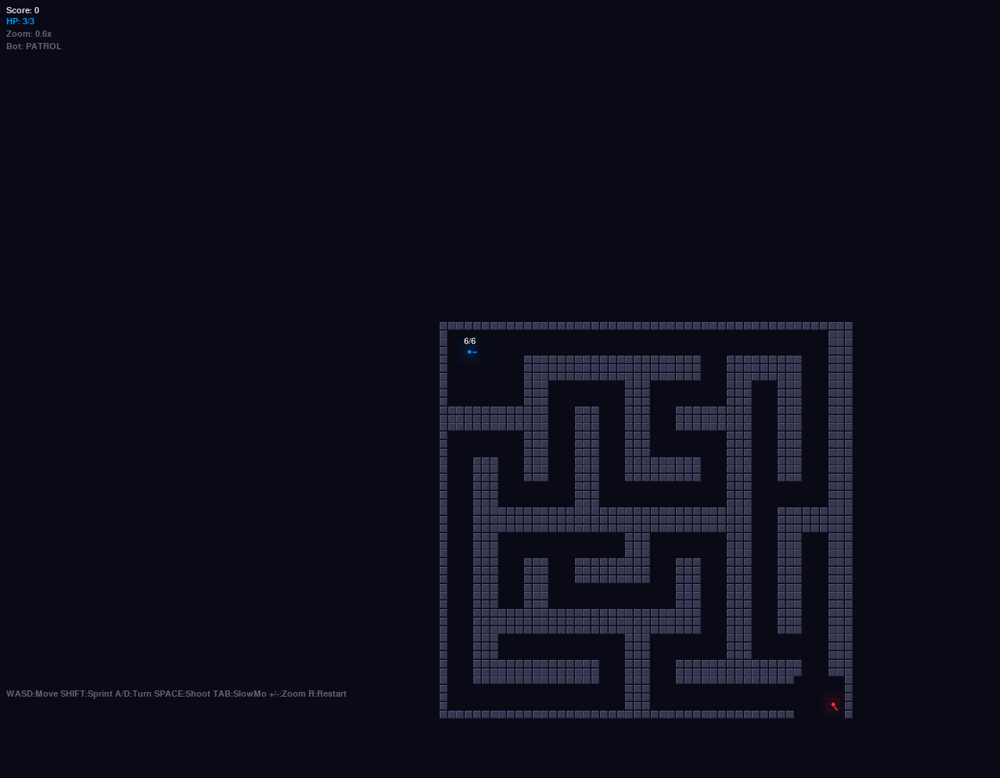

> 🤖 Этот проект на 100% сгенерирован с помощью ИИ. Простите меня. / 🤖 This project is 100% AI-generated. Forgive me.

# TANKcat 🎮

**Maze tank battle game** — full 360° rotation, smart AI, ricochet physics, slow-motion.




## Controls

| Key | Action |
|-----|--------|
| W/S | Move forward/backward |
| A/D | Rotate tank |
| Shift | Sprint |
| Space/RCTRL | Shoot |
| TAB | Slow-motion + bullet trails |
| +/- | Zoom camera |
| R | Restart |

## Features

- **360° tank rotation** — smooth aiming in any direction
- **3 HP system** — three hits before death, hit flash on damage
- **Maze generation** — procedural maze with 3-block-wide corridors
- **Smart AI bot** — three states: PATROL, CHASE, SEARCH
  - Detects player bullets and investigates
  - Pushes with line-of-sight tracking
  - Searches last known position
- **Ricochet** — bullets reflect off walls using proper vector reflection (`Vout = Vin - 2·(Vin·N)·N`)
- **Slow-motion** — TAB slows time to 0.12x with full bullet trajectory display
- **Camera** — follows player with zoom (+/-)
- **Visual polish** — neon glow, wall borders, reload bar

## Installation

```bash
pip install pygame
python tanket.py
```

## Multiplayer

> 🚧 В разработке / In progress

Планируется: кооператив и PvP по сети.

## License

GNU General Public License v3.0
